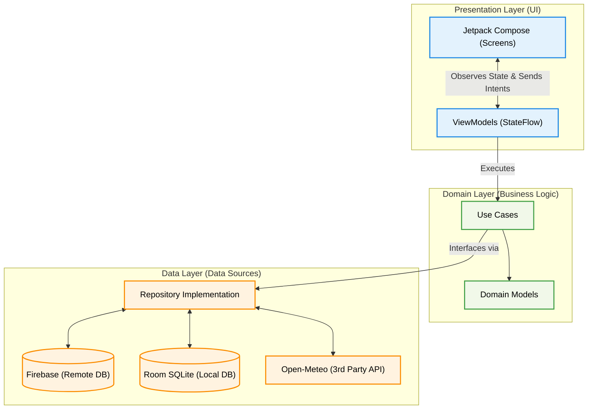

<div align="center">
  
  <h1>Balanja ULM</h1>
  <p>Aplikasi Direktori & Ulasan Kantin Mahasiswa Universitas Lambung Mangkurat</p>
  
  [](https://kotlinlang.org)
  [](https://developer.android.com/jetpack/compose)
  [](https://firebase.google.com)
  [](https://developer.android.com/training/data-storage/room)
  [](#)
</div>

---

## 📖 Latar Belakang & Deskripsi Proyek
**Balanja ULM** adalah aplikasi seluler berbasis Android (Kotlin & Jetpack Compose) yang dikembangkan untuk memfasilitasi mahasiswa Universitas Lambung Mangkurat (ULM) dalam mengeksplorasi jajanan, kantin, dan pedagang kaki lima di sekitar area kampus.

Mahasiswa seringkali dihadapkan dengan waktu istirahat yang sangat singkat di sela-sela pergantian mata kuliah. Tidak jarang mahasiswa merasa rugi waktu karena mendatangi kantin yang ternyata sedang tutup, atau merasa kebingungan memilih menu makanan karena minimnya referensi harga dan kualitas rasa.

Aplikasi ini hadir sebagai solusi terpadu dengan menyediakan **katalog menu interaktif**, **indikator buka/tutup secara *real-time***, **peta lokasi digital**, dan wadah untuk bertukar **ulasan (rating)** yang dikhususkan bagi ekosistem internal kampus ULM.

---

## 🏗️ Struktur Arsitektur (Clean Architecture)
Aplikasi ini diarsiteki dengan prinsip **Clean Architecture**, sebuah standar industri pengembangan perangkat lunak modern untuk memisahkan *logic* aplikasi dari kerangka kerja antarmuka (*UI framework*). Aplikasi dipecah ke dalam 3 lapisan (*layers*) utama:

1. **Presentation Layer (`presentation/`, `ui/`)**
   Bertanggung jawab menangani UI/UX menggunakan **Jetpack Compose**. Setiap layar (*screen*) dikendalikan oleh *ViewModel* terpisah yang mengelola UI State melalui `StateFlow`.
2. **Domain Layer (`domain/`)**
   Lapisan paling murni (*pure Kotlin*) yang tidak memiliki dependensi terhadap Android Framework. Lapisan ini berisikan *Data Models* abstrak dan rentetan *UseCases* untuk setiap *business logic* (contoh: `RecalculateStallRatingUseCase` untuk memastikan rating terhitung otomatis tanpa membebani *view*).
3. **Data Layer (`data/`)**
   Mengandung implementasi konkrit (Repository Impl) dari antarmuka yang didefinisikan pada Domain Layer. Lapisan inilah yang langsung berkomunikasi dengan *Data Sources* luar seperti Firebase (API), Open-Meteo (HTTP API), dan Room (Local DB).

**Visualisasi Alur Sistem (Clean Architecture):**
```text
com.example.balanja/
├── data/                                 # Data Layer: Implementasi antarmuka domain & eksekusi API
│   ├── api/                              # DTO & Service (CloudinaryApiService, WeatherApiService)
│   ├── local/                            # Room Database (DAO, Config DB, Entity SQLite)
│   └── repository/                       # Implementasi dari kontrak (misal: StallRepositoryImpl.kt)
│
├── domain/                               # Domain Layer: Aturan bisnis murni & Model Data
│   ├── model/                            # Kelas data murni (Stall.kt, Review.kt, User.kt)
│   ├── repository/                       # Interface murni (Kontrak akses untuk Data Layer)
│   └── usecase/                          # Logika spesifik terpisah per aksi (misal: RecalculateStallRating)
│       ├── auth/                         # (Login/Register/GoogleSignIn)
│       ├── favorite/                     # (Add/Delete/Get Favorite)
│       ├── review/                       # (Add/Edit/Get Reviews)
│       ├── search/                       # (Search & Recent)
│       ├── stall/                        # (GetStalls)
│       └── weather/                      # (GetCampusWeather)
│
├── presentation/                         # Presentation Layer: Layar UI & Manajemen State (ViewModels)
│   ├── auth/                             # LoginScreen.kt, RegisterScreen.kt, AuthViewModel.kt
│   ├── favorite/                         # FavoriteStallsScreen.kt
│   ├── home/                             # HomeScreen.kt, HomeViewModel.kt
│   ├── map/                              # MapScreen.kt (Integrasi Peta Osmdroid)
│   ├── profile/                          # EditProfileScreen.kt, ProfileScreen.kt
│   ├── review/                           # CommunityReviewScreen.kt, WriteReviewScreen.kt
│   ├── search/                           # SearchScreen.kt, SearchViewModel.kt
│   └── stall/                            # StallDetailScreen.kt, AddStallScreen.kt
│
└── ui/                                   # UI Layer: Komponen global, navigasi pusat, dan tema
    ├── component/                        # Composable daur ulang (StallCard.kt, WeatherWidget.kt)
    ├── navigation/                       # Setup NavHost, Daftar Rute, & BottomNavBar.kt
    └── theme/                            # Konfigurasi warna (Color.kt), Tipografi, dan Tema Jetpack
```

**Visualisasi Interaksi Antar Layer:**


---

## ✨ Fitur-Fitur Aplikasi

### 🎯 Fitur Wajib (Syarat UAS Mobile Programming)
Sesuai dengan matriks penilaian Ujian Akhir Semester, proyek ini mengimplementasikan penuh dua elemen fungsionalitas berikut:

1. **Integrasi Local Database (Room SQLite / Offline-First)**
   - **Warung Favorit (*Bookmarks*)**: Pengguna dapat menyimpan warung andalan mereka. Data disimpan murni di pangkalan data *smartphone* (`favorite_stalls` table), sehingga pengguna dapat melihat daftar warung favorit mereka secara instan meski ponsel tidak terkoneksi dengan internet.
   - **Riwayat Pencarian Berwaktu**: Saat pengguna mengetikkan sesuatu di *Search Bar* dan mengklik sebuah warung, rekam jejak tersebut disimpan secara lokal (`recent_searches` table) dan diurutkan berdasarkan parameter waktu terbaru (*timestamp-based sorting*).

2. **Integrasi Jaringan API Pihak Ketiga (*Fetching*)**
   - **Widget Prakiraan Cuaca Kampus**: Menggunakan **Open-Meteo API** untuk mengambil data suhu dan cuaca di area wilayah Banjarmasin secara *real-time*. Hasil panggil API (*JSON response*) di-*parse* ke layar beranda untuk membantu mahasiswa menentukan apakah mereka harus menunda pergi ke kantin karena kondisi cuaca/hujan.

### 🚀 Fitur Utama & Tambahan (Core Features)
- **Katalog Digital & Rentang Harga**: Menampilkan detail deskripsi warung, gambar *banner*, dan daftar menu lengkap beserta rentang harga (estimasi minimum-maksimum).
- **Status Operasional *Real-Time***: Pemilik warung dapat menekan sebuah tombol ("Buka"/"Tutup") yang datanya akan langsung tersinkronisasi (*Real-time listener*) di semua layar ponsel pengguna lain pada detik itu juga, menghemat waktu mahasiswa menuju warung tutup.
- **Sistem Ulasan (Rating & Review)**: Pengguna dapat memberikan nilai 1 hingga 5 bintang, menulis pengalaman mereka, menambah *tags* (misal: "Rasa Mantap", "Porsi Banyak"), dan melampirkan bukti foto makanan.
- **Peta Lokasi Terintegrasi (Osmdroid)**: Menampilkan tata letak visual letak gerobak pedagang di atas peta OpenStreetMap secara gratis, tanpa hambatan limitasi _API Key_ berbayar.
- **Sistem *Crowdsourcing***: Mahasiswa yang menemukan pedagang kaki lima baru di sekitar kampus bisa mengajukan informasi penjual tersebut ke *database* pusat melalui alur **Google Form**, sebuah mitigasi keamanan untuk mencegah *spam* data *dummy*.
- **Otentikasi Akun (Firebase Auth)**: Sistem gerbang masuk (Login/Register) agar ulasan makanan terjamin keasliannya dan terhindar dari anonimitas *troll*.

---

## 🛠️ Stack Teknologi & Layanan Cloud

| Nama Teknologi | Fungsi Pokok di Aplikasi |
| --- | --- |
| **Kotlin & Jetpack Compose** | Pembuatan UI secara deklaratif dan responsif. |
| **Firebase Authentication** | Manajemen pengguna, hashing kata sandi, sesi login persisten. |
| **Firebase Realtime Database**| Sinkronisasi NoSQL *cloud database* super cepat (*WebSocket*) untuk data warung, status buka/tutup, dan ulasan komunitas. |
| **Cloudinary API** | Layanan *Cloud Storage (CDN)* pengelola aset media berat (Foto Profil, Foto Menu). Melakukan *compressing* secara server-side agar irit kuota. |
| **Open-Meteo API** | HTTP API cuaca publik *open-source* tanpa limitasi *rate-limiting*. |
| **Osmdroid (OpenStreetMap)**| Pustaka pemetaan alternatif yang 100% *open-source* dan tidak butuh kartu kredit. |
| **Room Database (SQLite)** | Lapisan persistensi data lokal di atas platform Android. |
| **Retrofit2 & Coil** | *Client API fetching* (Retrofit) dan pustaka pemuatan gambar asinkron (Coil). |

---

## ⚙️ Cara Instalasi & Menjalankan Aplikasi

> **⚠️ PERHATIAN KEAMANAN PENTING (API KEYS):** 
> File kredensial proyek seperti `google-services.json` (untuk koneksi Firebase) dan `local.properties` (untuk API Key Cloudinary) **telah dimasukkan ke dalam `.gitignore` dan TIDAK BISA diunggah ke repositori GitHub publik ini** untuk mencegah kebocoran/peretasan *database*. Anda harus mengaturnya secara mandiri.

### Prasyarat Komputer
- **Android Studio** (Minimum versi *Iguana* / *Jellyfish*).
- Ponsel fisik atau Android Emulator dengan API Level 24+ (Android 7.0 Nougat ke atas).

### Panduan Instalasi Langkah-demi-Langkah
1. **Kloning Repositori Git**
   ```bash
   git clone https://github.com/UsernameAnda/Balanja-ULM.git
   ```
2. **Buka di Android Studio**
   Pilih `File` -> `Open` lalu arahkan ke folder yang baru di-*clone*. Tunggu hingga proses *Gradle Sync* selesai.
3. **Konfigurasi Firebase Authentication & Realtime Database**
   - Buat proyek baru di [Firebase Console](https://console.firebase.google.com/).
   - Daftarkan Android App dengan *package name* `com.example.balanja`.
   - Unduh file `google-services.json` yang diberikan Firebase.
   - Pindahkan/Salin file `google-services.json` tersebut langsung ke dalam direktori `app/` di proyek Anda.
4. **Konfigurasi Cloudinary API (Opsional untuk Fitur Unggah Foto)**
   - Buat akun gratis di [Cloudinary](https://cloudinary.com).
   - Dapatkan `Cloud Name`, `API Key`, dan `API Secret` Anda.
   - Buka file `local.properties` (di *root* proyek) dan tambahkan baris berikut:
     ```properties
     CLOUDINARY_CLOUD_NAME=masukkan_nama_cloud_anda
     CLOUDINARY_API_KEY=masukkan_api_key_anda
     CLOUDINARY_API_SECRET=masukkan_api_secret_anda
     ```
5. **Jalankan Aplikasi**
   Setelah semua konfigurasi aman, sambungkan *device* / Emulator, dan tekan ikon tombol **Run (▶)** hijau di bilah atas Android Studio.

---

## 📸 Antarmuka Pengguna (Screenshot UI)

> *(Catatan Editor GitHub: Harap sesuaikan URL gambar di bawah ini dengan menyalin langsung screenshot Anda agar tampilannya sesuai.)*

### ☀️ Mode Terang (Light Theme)

| Halaman Home (Beranda) | Detail Warung & Menu | Halaman Peta (Map) |
| :---: | :---: | :---: |
|  |  |  |

| Tulis Ulasan | Cek Ulasan | Cari Warung |
| :---: | :---: | :---: |
|  |  |  |

---

### 🌙 Mode Gelap (Dark Theme)

| Halaman Home (Beranda) | Detail Warung & Menu | Halaman Peta (Map) |
| :---: | :---: | :---: |
|  |  |  |

| Cek Ulasan | Buat Ulasan | Cari Warung |
| :---: | :---: | :---: |
|  |  |  |

---

<div align="center">
  <b>Dibuat dengan ❤️ oleh Mahasiswa Universitas Lambung Mangkurat.</b><br>
  <i>Hak Cipta © 2026 Tim Balanja ULM. All Rights Reserved.</i>
</div>
