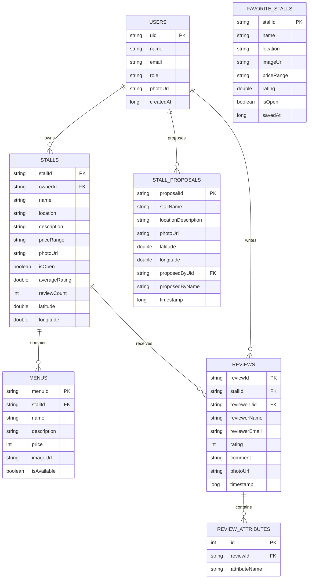
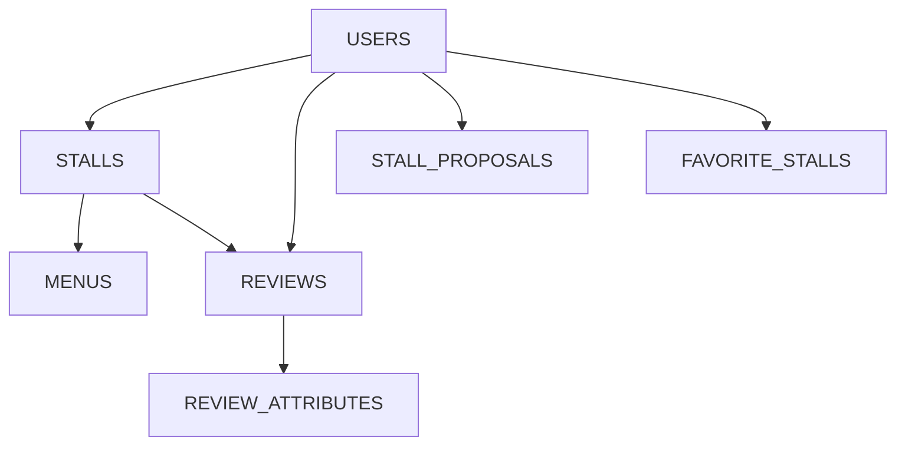

# Database Design — Balanja ULM

## Versi

v1.3 — UAS Revision

## Deskripsi

Dokumen ini menjelaskan struktur database aplikasi **Balanja ULM**, meliputi:

* Firebase Realtime Database
* Room Database (Favorit)
* Relasi antar entitas
* Struktur data Clean Architecture
* ER Diagram
* Mermaid visualization

Dokumen disusun berdasarkan:

* PRD Balanja ULM v1.3
* Sprint 3–5 Task Breakdown
* Firebase Structure Reference
* Fitur tambahan UAS (Weather API & Room Favorite)

---

# 1. Arsitektur Data

Aplikasi menggunakan kombinasi:

| Komponen              | Teknologi                  |
| --------------------- | -------------------------- |
| Backend realtime      | Firebase Realtime Database |
| Authentication        | Firebase Auth              |
| Storage gambar        | Firebase Storage           |
| Offline local storage | Room Database              |
| External API          | OpenWeatherMap API         |

---

# 2. Struktur Firebase Realtime Database

```text
Realtime Database
├── stalls/
├── reviews/
├── stallProposals/
└── users/
```

---

# 3. Struktur Entity Database

---

## 3.1 USERS

Menyimpan data pengguna aplikasi.

| Field     | Type        | Keterangan                  |
| --------- | ----------- | --------------------------- |
| uid       | String (PK) | Firebase UID                |
| name      | String      | Nama pengguna               |
| email     | String      | Email ULM                   |
| role      | String      | mahasiswa / penjual / admin |
| photoUrl  | String      | URL foto profil             |
| createdAt | Long        | Timestamp akun dibuat       |

### Relasi

* User dapat membuat banyak review
* User dapat mengusulkan banyak pedagang
* User dapat memiliki banyak favorit

---

## 3.2 STALLS

Menyimpan data stan makanan.

| Field         | Type                    | Keterangan         |
| ------------- | ----------------------- | ------------------ |
| stallId       | String (PK)             | ID stan            |
| ownerId       | String (FK → USERS.uid) | Pemilik stan       |
| name          | String                  | Nama stan          |
| location      | String                  | Deskripsi lokasi   |
| description   | String                  | Deskripsi stan     |
| priceRange    | String                  | Rentang harga      |
| photoUrl      | String                  | Foto stan          |
| isOpen        | Boolean                 | Status operasional |
| averageRating | Double                  | Rating rata-rata   |
| reviewCount   | Int                     | Jumlah review      |
| latitude      | Double                  | Latitude GPS       |
| longitude     | Double                  | Longitude GPS      |

### Relasi

* Stall memiliki banyak menu
* Stall memiliki banyak review
* Stall dapat difavoritkan banyak user

---

## 3.3 MENUS

Menyimpan daftar menu tiap stan.

| Field       | Type                         | Keterangan      |
| ----------- | ---------------------------- | --------------- |
| menuId      | String (PK)                  | ID menu         |
| stallId     | String (FK → STALLS.stallId) | Relasi stan     |
| name        | String                       | Nama menu       |
| description | String                       | Deskripsi menu  |
| price       | Int                          | Harga           |
| imageUrl    | String                       | Foto menu       |
| isAvailable | Boolean                      | Status tersedia |

### Relasi

* Banyak menu dimiliki satu stall

---

## 3.4 REVIEWS

Menyimpan ulasan pengguna.

| Field         | Type                         | Keterangan          |
| ------------- | ---------------------------- | ------------------- |
| reviewId      | String (PK)                  | ID review           |
| stallId       | String (FK → STALLS.stallId) | Stan yang direview  |
| reviewerUid   | String (FK → USERS.uid)      | User pemberi review |
| reviewerName  | String                       | Nama reviewer       |
| reviewerEmail | String                       | Email reviewer      |
| rating        | Int                          | Nilai 1–5           |
| comment       | String                       | Isi ulasan          |
| photoUrl      | String?                      | Foto ulasan         |
| timestamp     | Long                         | Waktu review        |

### Relasi

* Banyak review dimiliki satu user
* Banyak review dimiliki satu stall

---

## 3.5 REVIEW_ATTRIBUTES

Menyimpan quick attributes review.

| Field         | Type                           | Keterangan     |
| ------------- | ------------------------------ | -------------- |
| id            | Int (PK)                       | ID attribute   |
| reviewId      | String (FK → REVIEWS.reviewId) | Review terkait |
| attributeName | String                         | Nama attribute |

### Contoh Attribute

* Porsi Banyak
* Rasa Mantap
* Cepat
* Sesuai Harga

---

## 3.6 STALL_PROPOSALS

Usulan pedagang baru.

| Field               | Type                    | Keterangan       |
| ------------------- | ----------------------- | ---------------- |
| proposalId          | String (PK)             | ID usulan        |
| stallName           | String                  | Nama pedagang    |
| locationDescription | String                  | Deskripsi lokasi |
| photoUrl            | String                  | Foto lokasi      |
| latitude            | Double                  | Latitude         |
| longitude           | Double                  | Longitude        |
| proposedByUid       | String (FK → USERS.uid) | Pengusul         |
| proposedByName      | String                  | Nama pengusul    |
| timestamp           | Long                    | Waktu usulan     |

---

# 4. Room Database — Favorit

## Tabel: favorite_stalls

| Field      | Type        | Keterangan       |
| ---------- | ----------- | ---------------- |
| stallId    | String (PK) | ID stan          |
| name       | String      | Nama stan        |
| location   | String      | Lokasi           |
| imageUrl   | String      | Foto             |
| priceRange | String      | Harga            |
| rating     | Double      | Rating           |
| isOpen     | Boolean     | Status buka      |
| savedAt    | Long        | Timestamp simpan |

### Fungsi

* Penyimpanan offline
* Tetap tersedia tanpa internet
* Sinkronisasi cepat UI

---

# 5. Weather Cache (Opsional)

Digunakan untuk cache data OpenWeatherMap API.

| Field       | Type   |
| ----------- | ------ |
| id          | Int    |
| temperature | Double |
| description | String |
| humidity    | Int    |
| windSpeed   | Double |
| iconCode    | String |
| fetchedAt   | Long   |

---

# 6. ER Diagram (Mermaid)



---

# 7. Diagram Relasi Sederhana



---

# 8. Struktur Firebase JSON

```json
{
  "stalls": {
    "stall_01": {
      "name": "Pentol Teknik",
      "location": "Depan Gedung A",
      "priceRange": "Rp5.000 - Rp15.000",
      "isOpen": true,
      "averageRating": 4.8,
      "reviewCount": 25
    }
  },

  "reviews": {
    "stall_01": {
      "review_01": {
        "reviewerUid": "uid123",
        "reviewerName": "Fathi",
        "rating": 5,
        "comment": "Mantap dan murah"
      }
    }
  }
}
```

---

# 9. Firebase Storage Structure

```text
gs://balanja-app.appspot.com/

├── review_photos/
│   └── {uid}/{reviewId}.jpg

└── stall_proposals/
    └── {proposalId}.jpg
```

---

# 10. Clean Architecture Mapping

```text
presentation/
    ↓
domain/usecase/
    ↓
domain/repository/
    ↓
data/repository/
    ↓
Firebase / Room / API
```

---

# 11. Kesimpulan

Database Balanja dirancang menggunakan pendekatan:

* Realtime cloud database (Firebase)
* Offline local persistence (Room)
* Clean Architecture
* Modular repository pattern

Desain ini memungkinkan:

* realtime update
* offline support
* scalable architecture
* maintainable codebase
* integrasi API eksternal

---